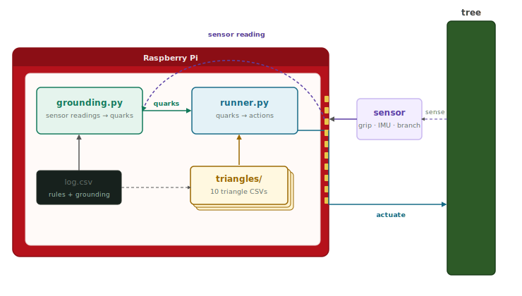

# PRD — Quark-driven robot on Raspberry Pi



## Goal

A tree climbing robot that senses its environment, maps readings to quarks, and fires actuator actions — running entirely on a Raspberry Pi with no cloud dependency except optional concept grounding.

---

## System overview

```
sensors → grounding.py → quarks → runner.py → actuators
                                      ↑
                              log.csv + triangles/
```

On each tick:
1. `grounding.py` reads sensor values and emits active quarks
2. `runner.py` receives the quark set, scores triangle overlap, fires actuator actions
3. The actuator layer translates action labels into GPIO signals

---

## Components

| file | role |
|---|---|
| `log.csv` | grounding rules (`i;lt/gt`) + triangle definitions |
| `triangles/` | ten pre-built triangle CSVs (grip, nav, energy, balance, obstacle, anchor, …) |
| `grounding.py` | inward layer — sensor readings → quarks |
| `runner.py` | execution layer — quarks → actuator actions |
| `quark_overlap.py` | fallback — maps unknown concepts to quarks via LLM (optional, needs API key) |

---

## Hardware requirements (Raspberry Pi)

| component | purpose | quark |
|---|---|---|
| IMU (MPU-6050) | lateral g-force, tilt | `stat heavy`, `force` |
| Force-sensitive resistor | grip force on bark | `stat soft`, `stat rough` |
| Ultrasonic / ToF sensor | path density ahead | `stat empty`, `pattern` |
| Flex / vibration sensor | branch oscillation | `stat fast` |
| Battery monitor (INA219) | charge level | `stat low`, `stat empty`, `stat full` |
| Servo × 4 | limb drive | actuator target |
| Suction pump | grip engage | actuator target |

All sensor names match the grounding rules already in `log.csv` — no code changes needed to wire them up.

---

## Behaviour in scope

- Climb, grip, and navigate a tree using the triangle library
- Respond to grip failure, low battery, branch instability, and path blockage
- Use `triangle_natural_anchor1` to identify and anchor to any load-bearing natural structure
- Escalate to orchestrator when no triangle resolves a quark within N ticks

## Out of scope (v1)

- Autonomous triangle generation (`build_triangle`)
- Vision / camera input
- Multi-robot coordination
- `quark_overlap.py` running on-device (API call — use cached `combinations.csv` only)

---

## Run on device

```bash
# install
pip install -r requirements.txt     # only stdlib + openai (optional)

# pipe grounding into runner
python grounding.py --pipe | python runner.py

# interactive test
python grounding.py
sensor> grip_force_n=12
sensor> battery_%=22
sensor> tick
```

---

## Triangle library loaded at startup

| triangle | goal | key sensor quarks |
|---|---|---|
| grip1 | `bond + force` | `problem`, `stat soft`, `stat rough` |
| nav1 | `loc + sequence` | `stat empty`, `pattern`, `stat broken` |
| energy1 | `energy + stat full` | `stat low`, `stat empty`, `stat hot` |
| balance1 | `normal + support` | `stat heavy`, `force`, `stat broken` |
| obstacle1 | `loc + normal` | `stat rough`, `problem`, `stat heavy` |
| natural_anchor1 | `bond + support` | `nature`, `support`, `machine`, `tool` |
| timing1 | `pattern + sequence` | `stat fast`, `waitfor` |

---

## Required enhancements to runner.py

`runner.py` currently prints actuator action labels to stdout. For Pi control it needs five additions:

**1. Hardware driver catalog**
A dict mapping action labels to GPIO calls. Currently `engage_suction` is a string; on the Pi it must call `gpio.output(PUMP_PIN, HIGH)`. The catalog is the only hardware-specific layer — all triangle logic stays unchanged.

```python
def engage_suction():
    gpio.output(PUMP_PIN, HIGH)

def increase_grip_pressure():
    servo.set_duty(GRIP_SERVO, duty + 5)

def position_gripper():
    servo.move(ARM_SERVO, 90)

def engage_anchor():
    gpio.output(ANCHOR_PIN, HIGH)

DRIVERS = {
    "engage_suction":         engage_suction,
    "increase_grip_pressure": increase_grip_pressure,
    "position_gripper":       position_gripper,
    "engage_anchor":          engage_anchor,
}
```

**2. Timed tick loop**
Currently runner.py waits for manual input. On the Pi it must run a continuous loop — read quarks from `grounding.py --pipe`, process them, fire actuators, repeat every N ms. The pipe already exists; the loop replaces the `input()` call.

**3. Triangle switching**
When a triangle reaches its goal or `stat broken` arrives unresolved, runner.py must load a different triangle from `triangles/` and make it the active set. Currently all triangles are always active. An `active_triangles` set controlled by the orchestrator rules gives the robot focused behaviour per situation.

**4. Actuator confirmation**
After firing an action, runner.py should wait for a confirming quark back from grounding.py before declaring success (e.g. fire `engage_suction` → wait for `stat rough` to appear, confirming grip). Timeout without confirmation → escalate. Currently runner fires and forgets.

**5. Escalation to orchestrator**
When `stat broken` arrives and no active triangle resolves it within N ticks, runner.py must activate the orchestrator rules from `log.csv` and hand off to the correct triangle. The orchestrator records are already parsed — the missing piece is the trigger condition and the triangle swap.

| enhancement | effort | blocks |
|---|---|---|
| Driver catalog | low | any real actuation |
| Timed tick loop | low | autonomous operation |
| Triangle switching | medium | focused behaviour |
| Actuator confirmation | medium | reliable grip/anchor |
| Escalation | medium | fault recovery |

---

## Definition of done

- Robot climbs three metres on a test tree without falling
- All sensor quarks fire correctly under demo scenarios (`python grounding.py --demo`)
- Triangle goal is reached at least once per climb attempt
- Full run logged to `log.csv` and inspectable after the fact
